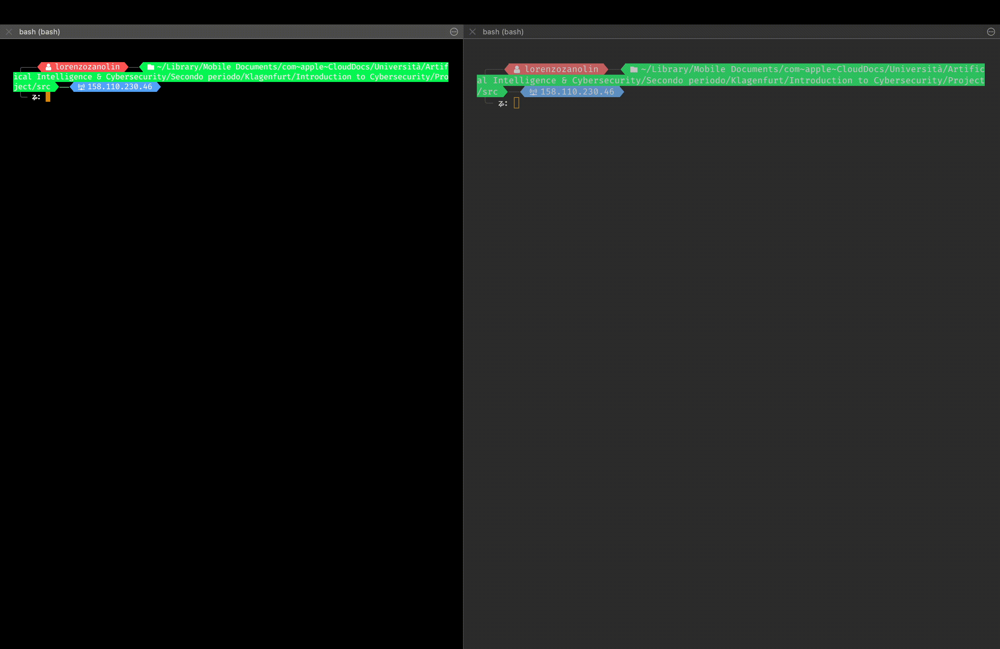

# Garbled Circuit
Project for the Introduction to Cybersecurity course. The aim is to develop an Yao's Protocol implementation[^fn3]; we will use it to sum two sets of values.  

In this project, as already written, the function used is the 8-bit sum. The circuit is represented in the above figure.

|  |
|:--:|
| <b>Circuit </b>|

It is made of two components: Half adder and full adder.

Half adder is used to sum the right-most digit of the number.

|  |
|:--:|
| <b>Half Adder </b>|

Full adder is used to sum a generic digit in the number, ranging from position 1 to 8. It receives in input also carry of the previous sum.

|  |
|:--:|
| <b>Full Adder</b>|

Alice and Bob have two sets of numbers (given by the user), they compute the sum of this set on their own. Then they execute the secure sum of their
set's sum using Yao's protocol.
Since we are using 8 bit to represent the sum of each set, it immediatly follows that the sum of each set must be smaller than 256. The final sum has 9 bit representation, thus the maximum result that we can obtain is 510.

## Project structure

The structure of the src folder is the following:

-   `MAKEFILE`: contains the commands to be executed.

-   `circuit/add.json`: contains the circuit of the 8-bit sum.

-   `sets/alice.txt`: Alice's input. User insert the input via terminal, then program saves it in this file

-   `sets/bob.txt`: Bob's input.  User insert the input via terminal, then program saves it in this file

-   `code/yao.py`: contains the library[^fn1].

-   `code/main.py`: contains the main logic of the script.

-   `code/util.py`: contains some useful functions used in main.

-   `code/requirements.py`: contains functions requested by the project.

-   `code/ot.py`: contains functions used to implement OT.

## Usage

You need to run the program using two different actors, say Alice and Bob. First, open two separate shells windows and execute `src/Makefile`.

```
cd src/  
make parties

NOTE: parties can be "alice" or "bob"
```

Now, for each party, you must enter the set of integers involved in the sum.

|  |
|:--:|
| <b>Example of the usage</b>|


[comment]: <> (Citations)

[^fn1]: [Roq21] Olivier Roques. Garbled circuit. [Accessed May-2023]. 2021.

[^fn3]: [Wik21b] Wikipedia contributors. Secure two-party computation — Wikipedia,
The Free Encyclopedia. [Online; accessed May-2023]. 2021.
